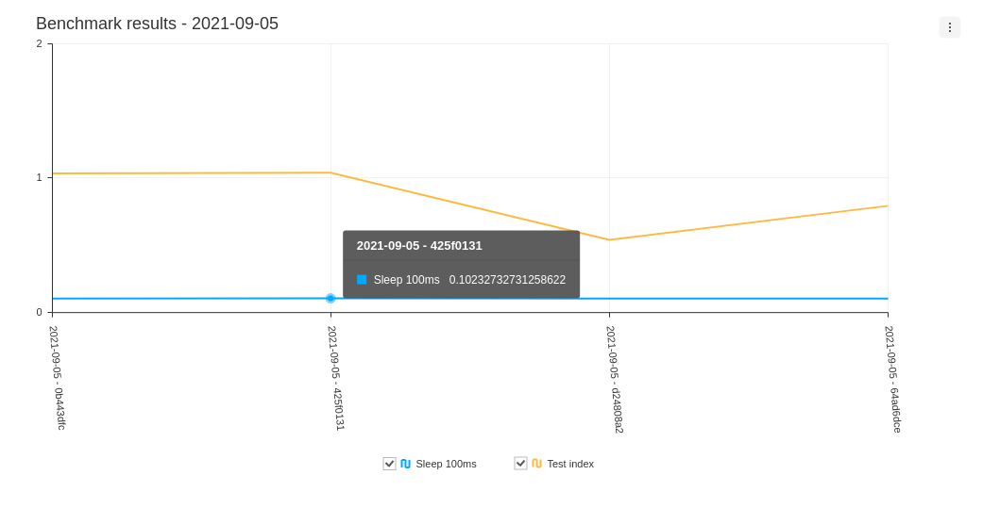

# hyperfine-action

[](https://github.com/blacha/hyperfine-action/actions/workflows/build.yml)


Runs [Hyperfine](https://github.com/sharkdp/hyperfine) as a github action and stores the result as a Github page.

Example Repo [Actions](https://github.com/blacha/hyperfine-action-test/actions)

Example output [Benchmarks](https://blacha.github.io/hyperfine-action-test/benchmarks.html)




Inspired by the [Denoland](https://github.com/denoland/deno) benchmark [suite](https://deno.land/benchmarks)

# Usage

Create a `.hyperfine.json`

```json
[
  { "name": "sleep", "command": "sleep 0.1" },
  { "name": "node", "command": "node -e 'console.log()'" }
]
```

Add the action to your github action
```yaml
    - uses: blacha/hyperfine-action@v1
```

output

```
Run blacha/hyperfine-action@v1
Starting benchmark Sleep 100ms
Benchmark #1: sleep 0.1
  Time (mean ± σ):     101.2 ms ±   0.1 ms    [User: 1.0 ms, System: 0.3 ms]
  Range (min … max):   101.0 ms … 101.4 ms    29 runs


Starting benchmark Test index
Benchmark #1: node index.js
  Time (mean ± σ):      5.039 s ±  0.002 s    [User: 28.8 ms, System: 6.7 ms]
  Range (min … max):    5.035 s …  5.043 s    10 runs
```

## Configuration

```yaml
- uses blacha/hyperfine-action@v1
  with:
    # Configuration file to use
    benchmark-config: '.hyperfine.json'
    # Number of benchmarks to keep
    count: 100
    # Branch to use for benchmarks output/benchmark.json
    benchmark-branch: 'gh-pages'
    # Where to store the output of the benchmarks
    benchmark-output: 'benchmarks.json'
    # benchmark html file to view the benchmarks
    benchmark-html: 'benchmarks.html'
    # Branch to use as the main or master for comparision
    master-branch: 'master'
    # configuration token
    github-token: ${{ github.token }}
```